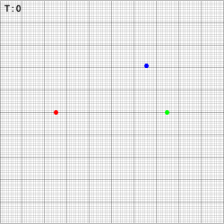
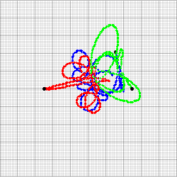
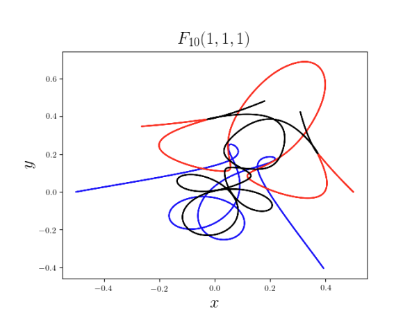

# ✨ three_body

a very rudimentary simulation of the three-body problem. i was curious how far we could get with just euler's method and a small time step, and it turns out we can get something pretty visually interesting!

i was also curious about what would happen if the polar coordinates of the bodies over time were translated into rgb values and animated over time; the results are below.

**warning**: some of the transitions from this orbit are pretty abrupt, so there may be flashing colors.

## sources

the starting positions for the graphics above are for periodic orbit F10 from this paper: https://arxiv.org/abs/1805.07980

This is what F10 looks like when solved with ODE solver dop853 (according to the paper):

as you can see, the error in the calculations above grow fairly noticeable after just 2 periods.
