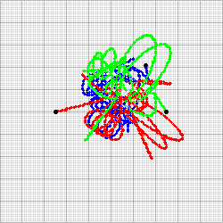

# ✨ three_body

a very rudimentary simulation of the three-body problem. i was curious how far we could get with just euler's method and a small time step, and it turns out we can get something pretty visually interesting!

the starting positions for the graphics above are for periodic orbit F10 from this paper: https://arxiv.org/abs/1805.07980

This is what F10 looks like when solved with ODE solver dop853 (according to the paper):

as you can see, the error is fairly noticeable after just 2 periods.
